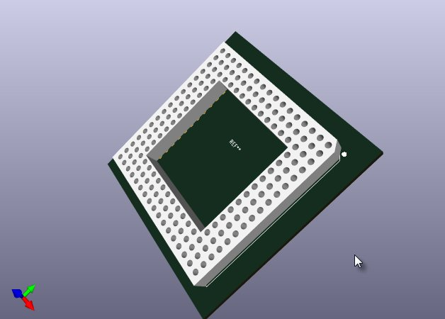
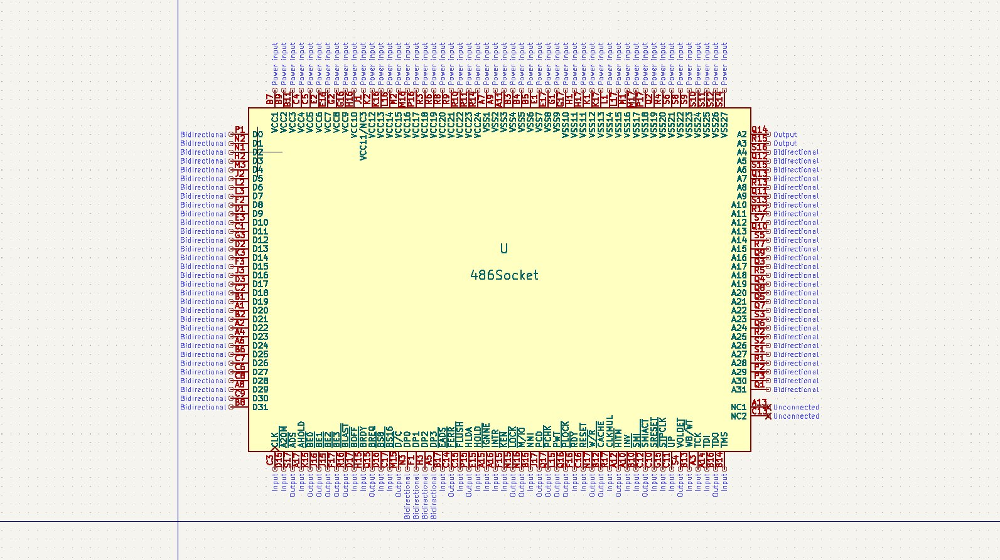
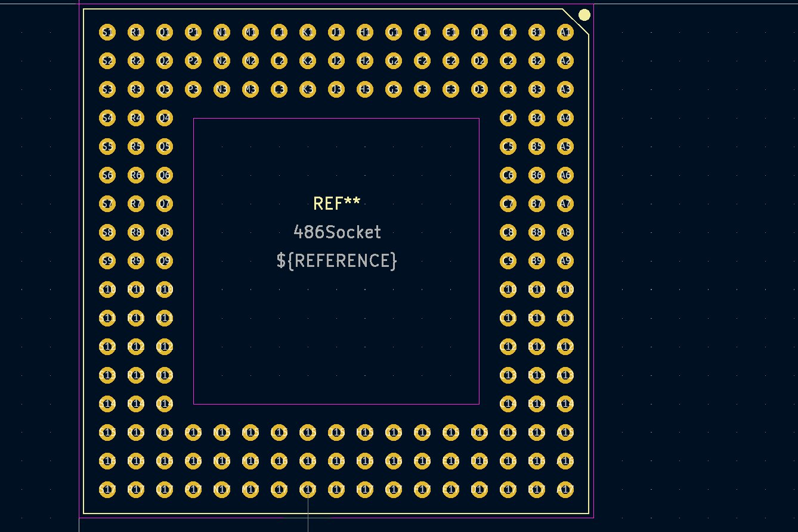

# KiCad-486-CPU-socket
486 CPU socket library for KiCad 7

## Installation

### Symbol installation
Use the following menu: "Preferences" -> "Manage Symbol Libraries..."
In "Global Libraries" or "Project Specific Libraries" add [486_Socket.kicad_sym](486_Socket.kicad_sym) file

### Footprint installation
Use the following menu: "Preferences" -> "Manage Footprint Libraries..."
In "Global Libraries" or "Project Specific Libraries" add [486_Socket.pretty](486_Socket.pretty) folder
If the 3D view is not working, open the footprint "486Socket", press E key and in "Footprint Properties" window, "3D Models" tab, add [486_Socket.step](486_Socket.step) file. Here you may need to adjust the offset of the 3D model to match the pinout.

## Images

